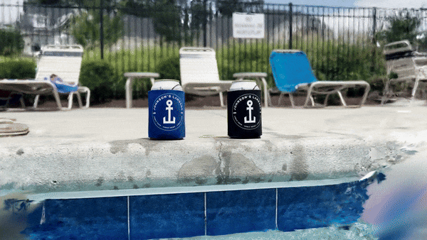

# Gaussian Explorer - Web App

This experimental project explores the application of Gaussian splats in 3D content. Gaussian splats, a technique often used in computer graphics, are utilized in this project to create and manipulate 3D content in innovative ways.

## Project Overview

The primary goal of this project is to push the boundaries of what's possible with Gaussian splats. It serves as a platform for demonstrating various techniques and algorithms to generate, render, and interact with 3D models using Gaussian splats.

While the current focus is on Gaussian splats, the project is designed with scalability in mind, aiming to add support for a Gaussian Explorer community in the future. This makes it not just a showcase, but also a sandbox for experimentation, innovation, and collaboration in 3D content creation.

## Features

- Exploration of 3D models using Gaussian splats
- Interactive manipulation of 3D content
- *More TBD*

This project is still in the experimental stage, and I welcome contributions and suggestions. Feel free to fork the repository and submit pull requests.
